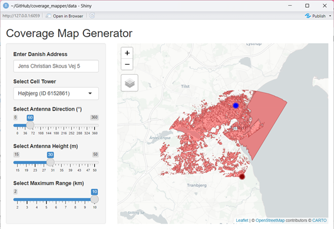
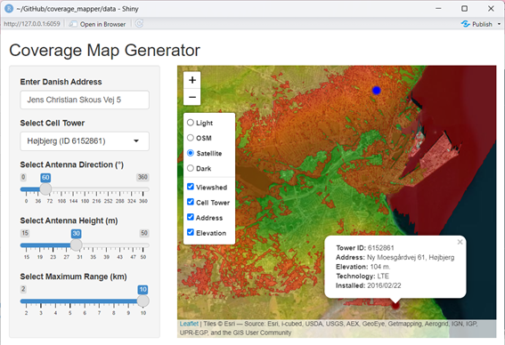

# Coverage Map Generator
An interactive Shiny app for generating line-of-sight-based coverage maps of Danish cell towers using viewshed analysis and elevation data.

## Table of Contents
- [Overview](#overview)
- [Preview](#preview)
- [Features](#features)
- [Getting Started](#getting-started)
- [Data Sources](#data-sources)
- [License](#license)

## Overview
This tool allows users to visualize theoretical coverage areas for selected cell towers in Denmark using elevation data and a simplified viewshed model. The app was developed for a university project to demonstrate how terrain variations in Aarhus municipality affects radio line-of-sight. However, the script supports replacing the municipality with another, if the elevation data and cell tower data is replaced.

## Preview
Here’s a look at the app interface with an example coverage map for a selected tower in Aarhus:



## Features
- Select and visualize Danish cell towers
- Define antenna direction, height, and maximum range
- Run viewshed analysis based on elevation raster and user settings
- Interactive map via Leaflet and Shiny
- Choose between four basemaps and optionally add elevation as overlay
- Compare with specific Danish address

## Getting Started
The script has the following dependencies and requirements:
- R (≥ 4.0.0)
- R packages: 
`geodata` (0.6.2), `leaflet` (2.2.2), `raster` (3.6.32), `sf` (1.0.20), `dplyr` (1.1.4), `terra` (1.8.50), `viewscape` (2.0.2), `tidygeocoder` (1.0.6), `mapview` (2.11.2), `shiny` (1.10.0)

**Running the app:** Clone the repo, and run the main.R script in R.

Cloning the repo should download the `main.R` script and the zipped `data` folder. The main script contains all code needed for running the project including loading and processing the data, and running the Shiny app.

```r
source("main.R")
```
If the app window does not open automatically in RStudio, try:
- Clicking the Run App button, or
- Selecting all code (Ctrl+A) and running (Ctrl+Enter)

**Note:** Keep the data zipped - the main.R script will unzip the data in the correct way.

## Data Sources
- Cell tower data: [Mastedatabasen](https://www.mastedatabasen.dk)
- Elevation data: [Dataforsyningen](https://dataforsyningen.dk/data/930)

## License
This project is licensed under the MIT License – see the [LICENSE](LICENSE) file for details.